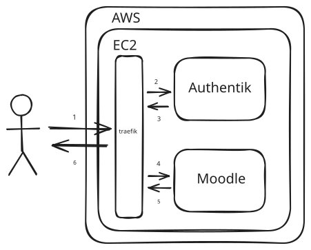

# Installation

Both plugins are located in the [plugins](../plugins/) directory.

To install them, copy each plugin to the appropriate Moodle directory and rename each directory to `gitlab`:

- [**customfield**](../plugins/customfield) → `public/customfield/field`.
- [**module**](../plugins/module) → `public/mod`.

Once both plugins have been copied to their respective locations, log in to your Moodle site as an admin and go to _Site administration_ → _Notifications_ to complete the installation.

Alternatively, you can run

```
php admin/cli/upgrade.php
```

to complete the installation from the command line.

# Development

## Contributions

Contributions to this project are welcome.

First, fork the repository. All changes should then be submitted via pull requests.

Bug reports and feature requests can be submitted via the issue tracker.

## Infrastructure

This repository includes a simple Terraform configuration to provision an AWS EC2 instance capable of hosting a Moodle instance.

If you already have a machine with SSH access or want to run it locally, you can skip this step.

```bash
cd terraform
terraform init
terraform apply
```

## Deployment

You can choose between two deployment options.

The manual deployment only sets up Moodle, while the Ansible-based deployment also configures Moodle behind [Authentik](https://goauthentik.io/) as an authentication provider.

### Manual

A simplified Moodle development environment is available via my [fork](https://github.com/LeonardJouve/moodle-docker) of [moodle-docker](https://github.com/moodlehq/moodle-docker).

Clone repositories

```bash
git clone https://github.com/LeonardJouve/moodle-docker.git
cd moodle-docker
git clone https://github.com/LeonardJouve/moodle-gitlab-integration.git
```

Create a file named `docker-compose.override.yml` in the `moodle-docker` directory:

```yml
services:
  webserver:
    volumes:
      - "./moodle-gitlab-integration/plugins/module:/var/www/html/public/mod/gitlab"
      - "./moodle-gitlab-integration/plugins/customfield:/var/www/html/public/customfield/field/gitlab"
    environment:
      MOODLE_DOCKER_WEB_PORT: ""
```

Create a `.env` file in the `moodle-docker` directory:

```
DB_USER=<db_user>
DB_NAME=<db_name>
DB_PASSWORD=<db_password>
DB_PORT=<db_port>
WEB_HOST=<moodle_external_host>
WEB_PORT=<web_port>
```

Run the following command to start the environment:

```bash
docker compose -f docker-compose.yml -f docker-compose.override.yml up -d
```

### Ansible

> [!WARNING]
> These playbooks are still a work in progress and require manual configuration.



This repository includes Ansible playbooks to provision a server with SSH access and a Moodle instance.

First modify `ansible/inventory.ini` with your host and URL configuration.

Then update `ansible/group_vars/all.yaml` with your host and URL configuration.

For DNS, you can use a service such as [DuckDNS](https://www.duckdns.org/), which provides an easy-to-setup and free dynamic DNS solution.

Finally modifiy `ansible/playbooks/res/moodle-authentik.yaml` with your host and URL settings.

You can now run Ansible playbooks:

```
cd ansible
ansible-playbook -i inventory.ini playbooks/base.yaml
ansible-playbook -i inventory.ini playbooks/traefik.yaml
ansible-playbook -i inventory.ini playbooks/authentik.yaml
ansible-playbook -i inventory.ini playbooks/moodle.yaml
```

After deployment, complete the Authentik setup by visiting:
```
http://<authentik_external_host>/if/flow/initial-setup/
```

If the authentik blueprint apply failed, rerun the playbook after creating your Authentik account:
```
ansible-playbook -i inventory.ini playbooks/authentik.yaml
```

You may also need to:
- Remove the automatically created moodle outpost
- Expose the Moodle application using the default outpost
- Enable the Local Docker connection integration on the selected outpost

Your app should now be running and accessible at:
```
http://<moodle_external_host>
```

# Configuration

## Notifications

To enable student web notifications for assignment deadlines, configure _Notification of GitLab submissions_.

This will send:

- One notification 1 day before the assignment due date
- One notification on the due date

You can enable this under:

_Site administration_ → _Messaging_ → _Notification settings_ → _gitlab_

## Webhooks

The module plugin exposes a webhook endpoint that must be publicly accessible without authentication, as it is called directly by GitLab.

```
https://<moodle-host>/mod/gitlab/webhook.php
```

The received data is signed by GitLab, and the signature is verified by the Moodle plugin. This ensures payload authenticity and integrity.

If any form of authentication blocks access to the endpoint, GitLab will not be able to trigger webhooks.

## Timezone

Assignment due dates are interpreted according to the Moodle instance timezone.

You can configure this under:

_Site administration_ → _Location_ → _Location settings_ → _Default timezone_
