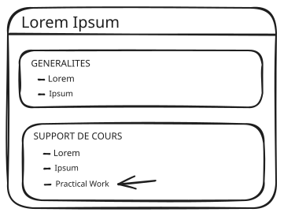
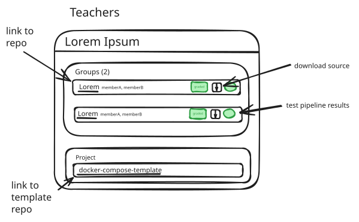
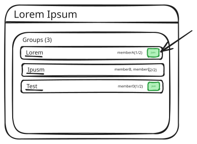
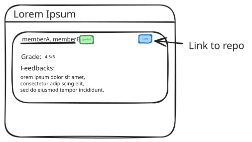
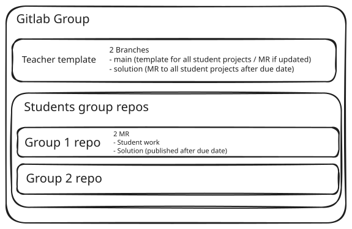

### Introduction

Moodle is a widely used Learning Management System.
Gitlab is an open source Git repository hosting platform.
In the educational IT domain they are both very often used together for practical works.
The main issue is there are no interactions one with another at all.

The aim of this project is to create an integration with Gitlab from Moodle.
This would ease the teachers work while setting up and grading pratical works.
This would also ease students by centralising informations and access to their given code.

This will be done through a Moodle plugin.
The plugin will add an [activity module](https://docs.moodle.org/501/en/Activities) named `Practical Work`.

### Teachers

Teachers will be able to create such module and set different properties such as:
- name
- description
- instructions
- due date
- groupe size
- reviewer

Once defined, the teacher have acces to a Gitlab repository used as a template for students repositories.

Each students group will have its own Gitlab repository.
From Moodle, teachers will be able to:
- see a list of students groups
- manage groups
- access each group repository
- see last CI jobs results
- see individual participation insights
- download source code
- see wether the group has already been graded

### Students

On the other side, students will be able to:
- view groups list
- join group
- create group

Once a student has joined a group, he should be able to:
- access his repository
- see practical work instructions under the Gitlab issues
- see the grade / feedbacks on Gitlab MR and on Moodle
- receive a notification after grading
- view the practical work due date in the moodle calendar

### Automation

Once a `Practical Work` module is created, a Gitlab group as well as a Gitlab repository will automatically be created.

The group will contain all repositories related to the practical work.

The repository will be used as a template for students repositories and will only be accessible by teachers and reviewers.

Teachers and reviewers will be able to commit the initial project to the `main` branch and the solution to the `solution` branch.

Once a modification is made to the template repository, a merge request is created to update all the existent student repositories.

For each student group creation, a repository is created with correct visibility and assignments.

A merge request is created and will be used for grading.

An issue is created as well with the practical work instructions.

Grades and feedbacks are visible by students on Moodle after beeing published in the correction merge request by reviewers.

After the practical work due date, the template `solution` branch is published with a merge request to all students.

### Other

Some custom integrations could be done with internal HES-SO tools `Gaps` and `Eval` but are to be determined.

### Features list

Graded with priorities from *1* to *4*:
- *1* = highest priority
- *4* = lowest priority

#### Gitlab Group
- Gitlab template | *1*
    - commits to the template trigger MR to all repositories => webhook | *1*
    - solution branch => MR to all repo after due date | *2*
- Sub repo (based on template) per team (correct visibility) | *1*
- Create issue (instructions) + merge request | *1*

#### Teacher Dashboard
- Create new project | *1*
    - name
    - description
    - instructions
    - due date
    - groupe size
    - assign reviewer
- Group list | *1*
- Direct access to repo | *1*
- CI jobs results | *1*
- Commits participations / lines | *2*
- Download source button | *2*
- Status (graded / non-graded) | *1*

#### Student Dashboard
- Join group => init group repo | *1*
    - Automatically add project due date to Moodle calendar | *1*
- Link to repo | *1*
- Grade / feedbacks (from MR) | *1*
    - Notification after grading | *2*

#### Support multiple Git hosting platform
- Gitlab | *1*
- Github | *3*
- Must use interfaces to allow other plateforms in the future | *1*

#### Eval
- Activity module | *4*
- Link | *4*
- Grade | *4*
- Solution / feedback after evaluation (link) | *4*

#### Gaps
- Include course calendar to Moodle calendar | *3*
- Retrieve unit description from Gaps | *3*
