# Features

The objective of this integration is to enable interactions with GitLab features from within Moodle while automating repetitive workflows.

# Configuration

## GitLab token

To get started, the first thing to configure is the GitLab token to use for this course.

It must be defined on each course.

This can be set in the course settings under the newly created `GitLab` section.

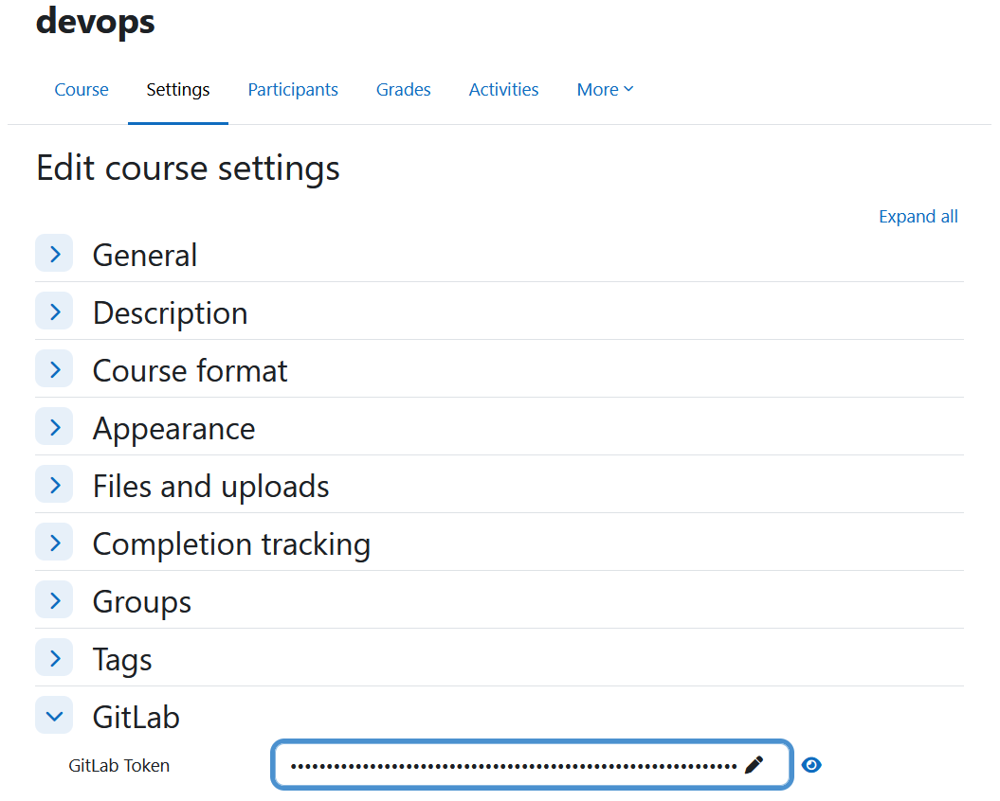

The token is stored encrypted in the database.

## GitLab username

Each user must also bind a GitLab username to its Moodle user.

This can be done in the profile edition tab under the newly created category `GitLab`.

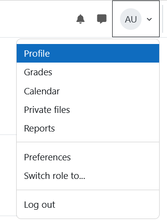

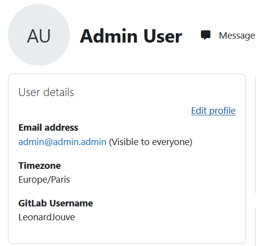

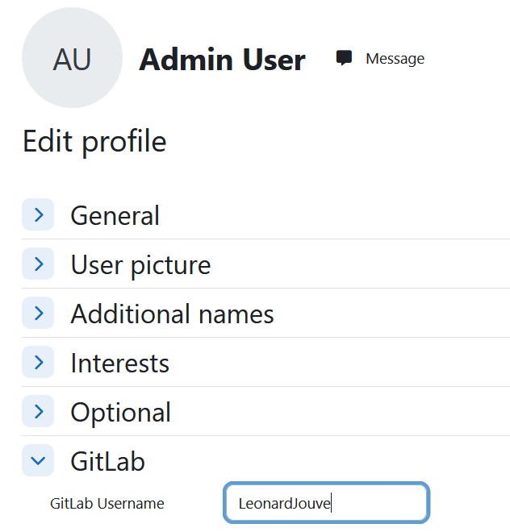

## GitLab group

> On GitLab.com, you must use the GitLab UI to create groups without a parent group. You cannot use the API to do this. See the GitLab [documentation](https://docs.gitlab.com/api/groups/#create-a-group)

Before using this feature, you must manually create a parent group in the GitLab web interface. This parent group will then be available to select as the container for the resources created.

You can create a parent group [here](https://gitlab.com/groups/new#create-group-pane)

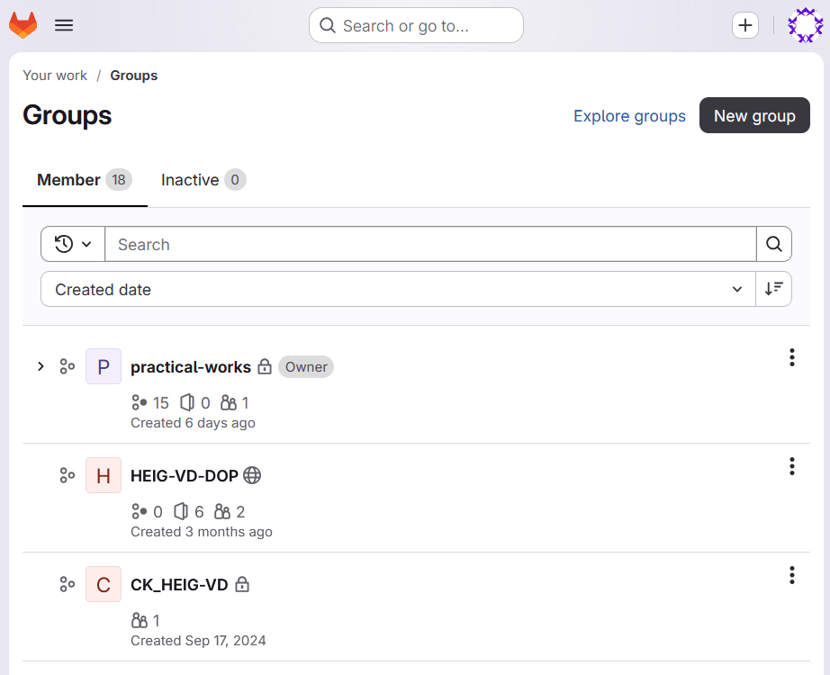

# Usage

## Create module instance

To create a plugin module instance, add a new resource and select the GitLab activity type.

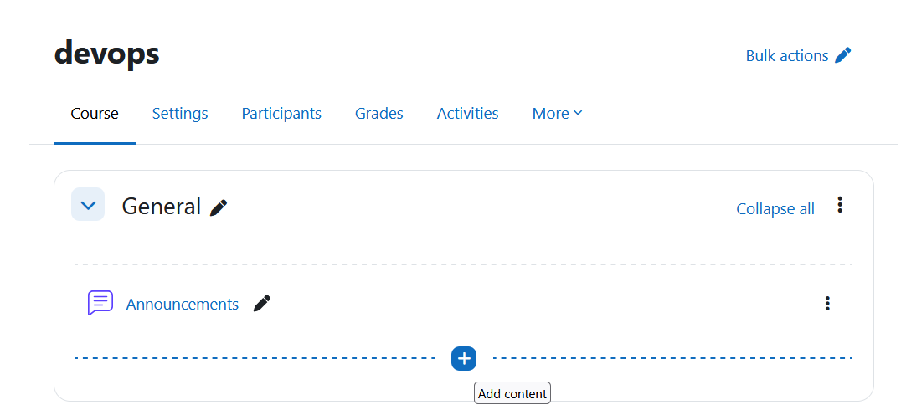

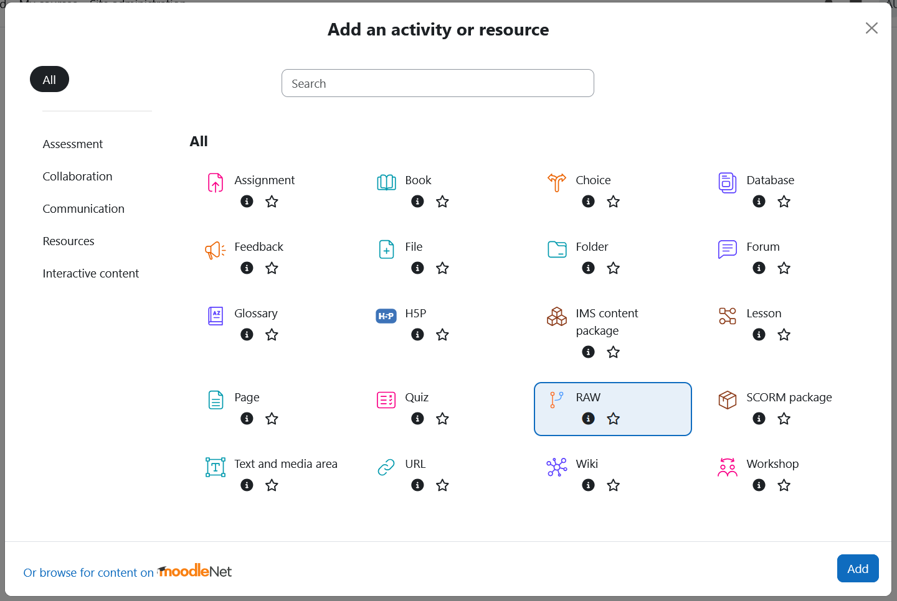

You can then configure the module.

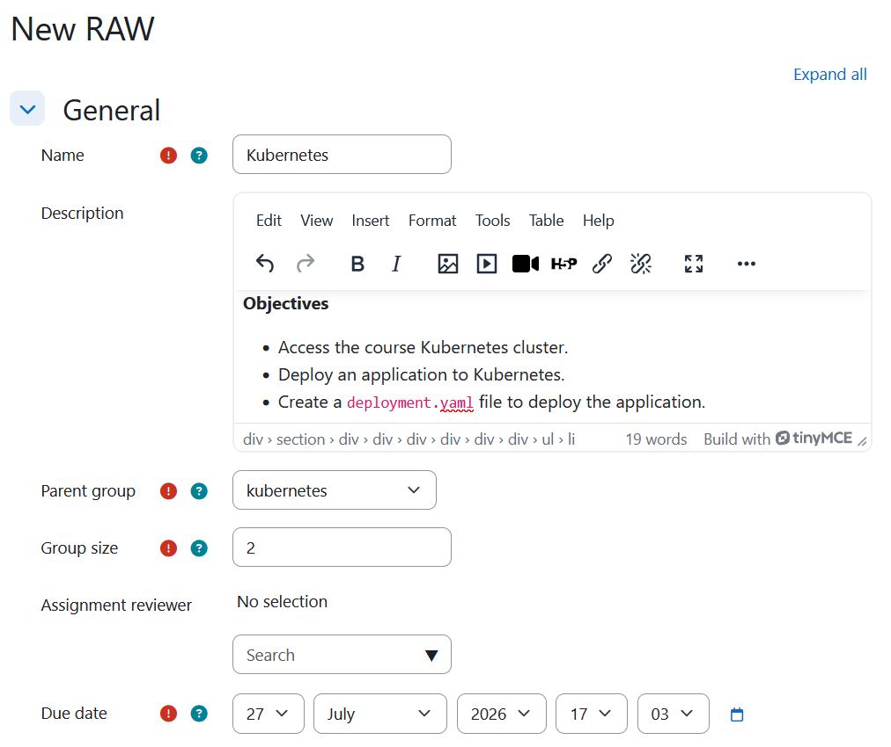

Configure the following settings:
- **Name and Description**: Provide a name and description for the module.
- **GitLab parent group**: Select the GitLab parent group where all resources created by the plugin for this module will be stored.
- **Reviewers**: Select one or more Moodle users to act as reviewers. These users will be granted _Maintainer_ access to every GitLab repository created by the module.
- **Submission due date**: Set the submission deadline. Make sure the correct timezone is configured in Moodle, as all dates are interpreted using the Moodle instance's timezone.

## Template

The template repository is accessible by teachers and reviewers. It provides a central location to prepare the practical work and define the initial project scaffold.

Teachers can use this repository to configure the starting files, instructions, and resources required for the practical work before group repositories are created.

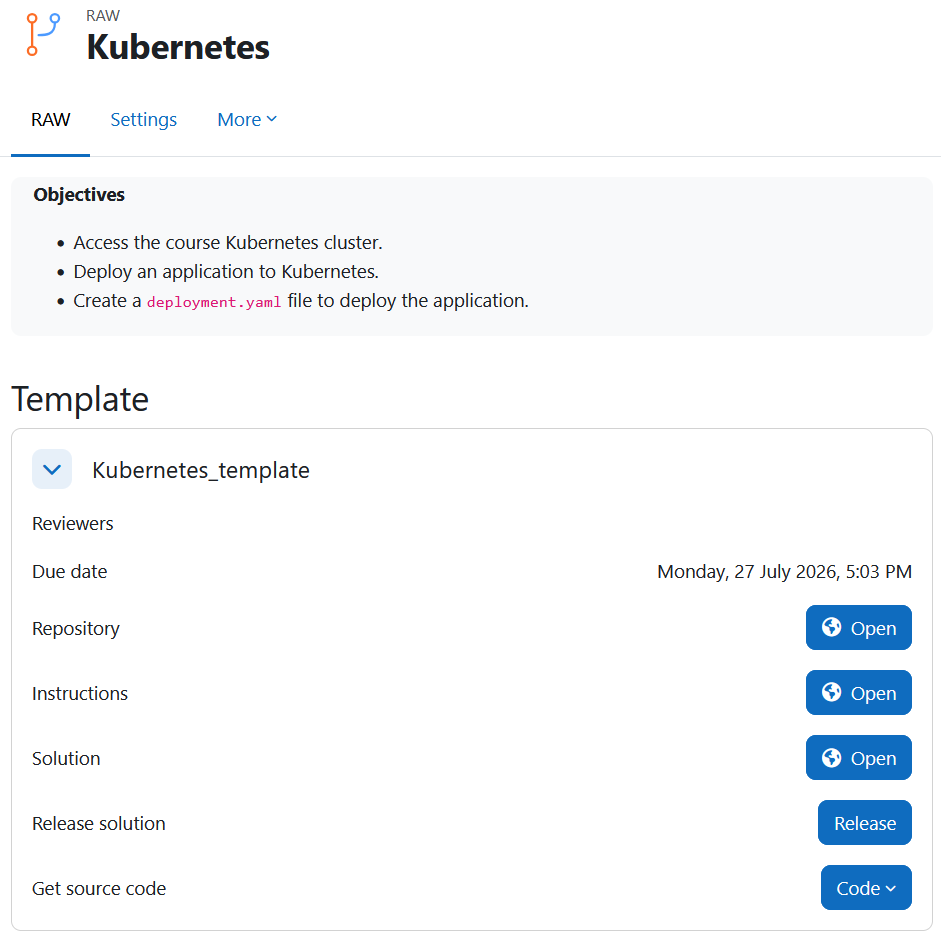

## Groups

Teachers can also create, manage groups and set members.

Reviewers and teachers can access group submissions through multiple methods.

- **Clone the repository**
  - Using **SSH**
  - Using **HTTPS**

- **Checkout the commit at the submission due date**: This allows reviewers to inspect the exact state of the repository at the deadline.
- **Checkout the merge request branch from the template repository**: Each group submission is available as a merge request in the template repository. This allows reviewers to review submissions from a single repository without having to clone each group repository individually.
- **Download the source code as a ZIP archive**: The source code can be downloaded either from the version available at the submission due date or from the latest repository state.

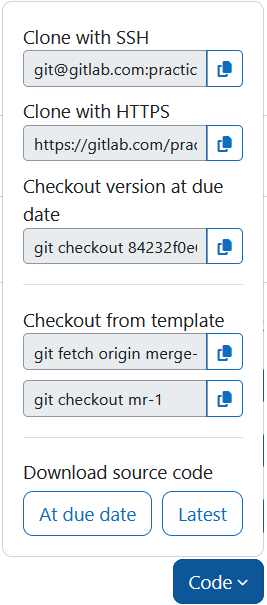

If students are not assigned to any group, they can create, view, and join available groups.

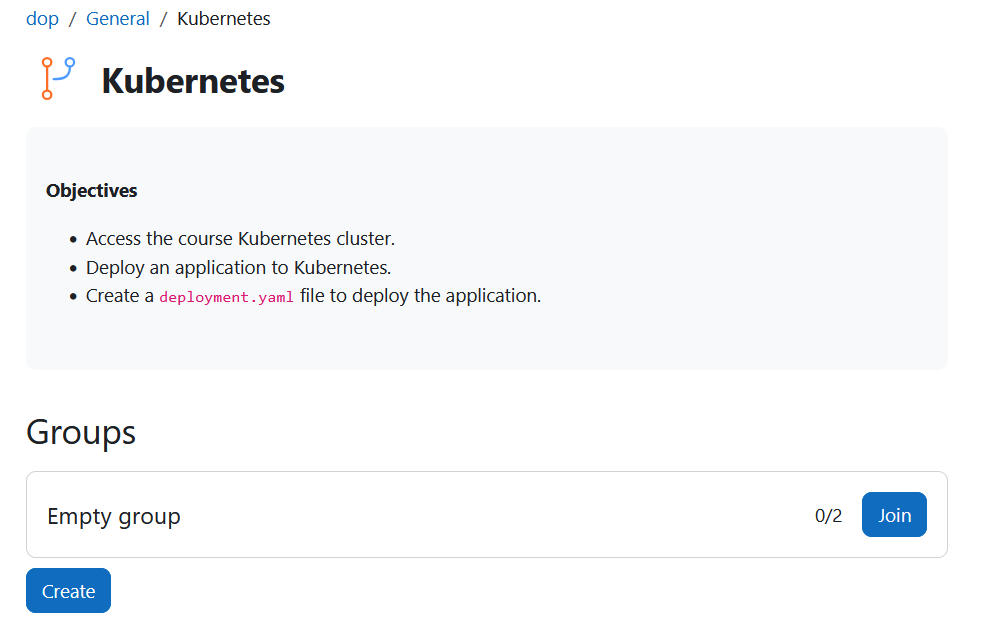

Once a student is part of a group, the available group options become accessible.

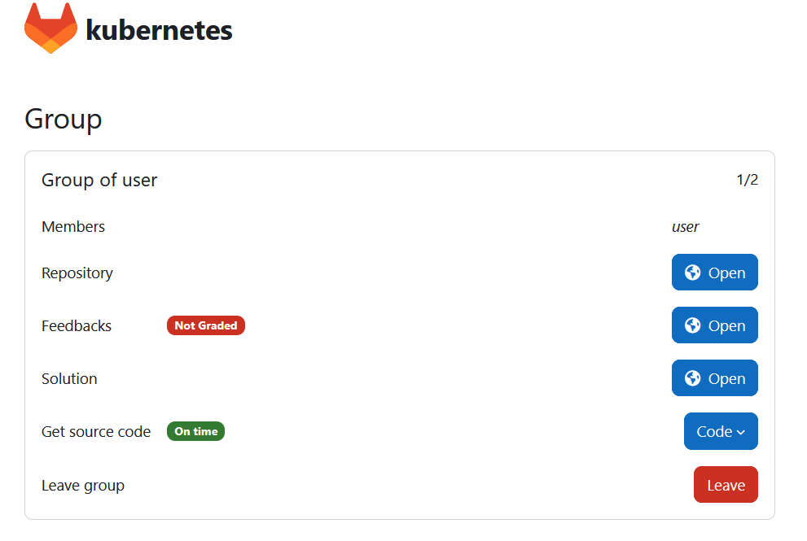

## Evaluation

To evaluate each group, reviewers should add their comments directly to the student repository submission merge request and close the merge request once the evaluation is complete.

The group status will then be automatically updated to "graded" in the Moodle interface.

# GitLab resources

The plugin automatically creates the following GitLab resources.

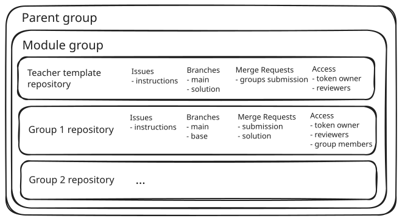

## Module group

When a module instance is created, the plugin automatically creates a GitLab group inside the selected parent group. This group contains all GitLab resources associated with the module.

## Template repository

A template repository is created for the practical work.

Only the GitLab token owner and the selected reviewers have access to this repository.

The repository contains:
- An issue containing the practical work instructions. This issue is replicated to every group repository.
- 2 branches:
    - **main**: The template used to initialize all group repositories.
    - **solution**: The reference solution for the practical work. After the submission due date, this branch is proposed to each group as a merge request.

After the submission due date, each group's submission merge request is also mirrored to the template repository, allowing reviewers to access all submissions from a single location.

## Group repositories

A fork of the template repository is created for each student group.

Repository access is configured as follows:
- Group members as _Developer_
- The GitLab token owner as repository _Owner_
- The selected reviewers as _Maintainer_

Each group repository contains:
- A copy of the template instructions issue.
- Two branches:
    - **main**: The branch used by the group to submit their work.
    - **base**: A protected branch used as the baseline for tracking the group's changes.

A merge request from **main** to **base** is automatically created, allowing reviewers to easily inspect the group's modifications.

After the submission due date, each group repository receives a merge request containing the contents of the template repository's solution branch.

## Webhook

A webhook is automatically created in the template repository.
The webhook listens for:
- **Issue** events.
- **Push** events affecting the **main** branch.

When one of these events occurs, GitLab notifies Moodle that the template repository has been updated.

Moodle then propagates the changes to all group repositories:
- Changes to the instructions issue are applied directly to the corresponding issue in each group repository.
- Changes pushed to the **main** branch are propagated through merge requests, allowing each group to incorporate the latest updates.

This mechanism allows teachers and reviewers to make changes to the practical work even after the group repositories have been created.

To ensure the authenticity and integrity of webhook requests, GitLab signs each webhook payload using a module-specific secret generated by Moodle. This secret is stored encrypted in the Moodle database and is used to verify every incoming webhook request.

> [!IMPORTANT]  
> The Moodle `/mod/gitlab/webhook.php` endpoint must not be protected by authentication, otherwise GitLab will not be able to send webhook requests to Moodle.
> 
> If authentication cannot be disabled, custom headers can be configured in the GitLab webhook settings to provide the required authentication information.

## Protected files
A GitLab CI verification job is created in all repositories to detect modifications to listed protected files.

The job runs automatically for merge request pipelines and compares the files modified by the merge request against a list of protected file patterns defined in `.gitlab/protected-files`.

The `.gitlab/protected-files` file is a simple text file where each protected file or pattern is defined on a separate line.

If a modified file matches one of the protected patterns, the pipeline fails and reports the affected file.

This provides feedback to students when they have modified a protected file, and informs teachers when a group has changed a file that should not have been modified.

> [!NOTE]
> This protection mechanism is intended as an informational safeguard and should not be considered a security feature. It helps identify potentially sensitive modifications for reviewers and developers but does not prevent users from modifying the CI configuration.

# Moodle

## Calendar

The plugin integrates with the Moodle calendar to provide group members with the submission due date and help them track upcoming deadlines directly from Moodle.

## Notifications

The plugin uses Moodle notifications to inform users about relevant events.

A notification is sent to group members one day before the submission due date as a reminder. Another notification is sent after the due date to inform them that the submission deadline has passed.

## Tasks
The plugin uses Moodle adhoc tasks to execute and plan operations asynchronously.

Make sure that the `cron.php` script is running and configured correctly, as described in the Moodle [documentation](https://docs.moodle.org/502/en/Cron).