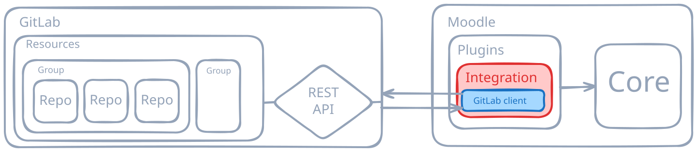

# Integrating GitLab with Moodle

Bachelor Thesis — HEIG-VD

Jouve Léonard

Improving developer workflows in computer science education

---

# The Problem

Moodle and GitLab are both heavily used in computer science education, but operate independently.  
This separation creates fragmented workflows for teachers and students.

### Teachers

- Create repositories manually
- Configure GitLab permissions by hand
- Manage multiple platforms

### Students

- Inconsistent workflows between courses
- Switch between LMS and VCS
- Grades, deadlines, repositories in different places

Current solutions are either **proprietary**, **GitHub-focused**, or **poorly integrated with Moodle**.

---

# Proposed Solution

A native Moodle plugin that integrates directly with GitLab through a dedicated PHP API client

### Automation

Create and manage GitLab resources from Moodle

### Unified Experience

Centralized assignments, repositories, grades, and feedback

### Extensible Design

Modular architecture allowing future support for other VCS providers

---

# State of the Art

No open-source solution currently provides a complete Moodle-native integration with GitLab

| Solution | Open Source | Moodle Native | GitLab Support |
|---|---|---|---|
| GitHub Classroom | ❌ | ❌ | ❌ |
| Zohoflow | ❌ | ❌ | ✅ |
| Classmoji | ✅ | ❌ | ❌ |
| Canvas Gitlab Integration | ✅ | ❌ | ✅ |
| **This Project** | ✅ | ✅ | ✅ |

The project aims to fill this gap with a native fully integrated and extensible open-source solution

---

# Proof of Concept

A Moodle module plugin to demonstrate the integration idea.

### Features

- Add a GitLab activity module
- Set a GitLab API token per course
- Automatically create groups / repositories for students
- Access repositories from Moodle
- Display created repositories list

### Infrastructure as Code

- **Terraform** for infrastructure provisioning
- **Ansible** for automated configuration
- **Authentik** for authentication
- **GitHub Actions** for continuous deployment

---

# Project Progress

### Completed

- Project specifications and planning
- State-of-the-art research
- Moodle proof-of-concept module plugin
- Cloud infrastructure
- GitLab REST API PHP client
- Intermediate thesis report

### Next Steps

- Teacher dashboard
- Student group selection / overview
- Advanced GitLab automation (webhooks, merge requests)

The technical foundation is complete.  
The project is now entering its main implementation phase.

---

<h1>Demonstration</h1>

