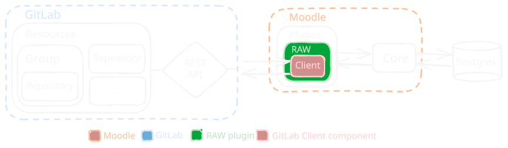

# Solution

<h3 style="margin-bottom: 0px">Repository Assignment Workflow (RAW)</h3>

A Moodle-native, extensible, and open-source solution.

- Follows the 3 design principles defined previously
- Built using two Moodle plugins:
  **Custom Field**, **Activity Module**

